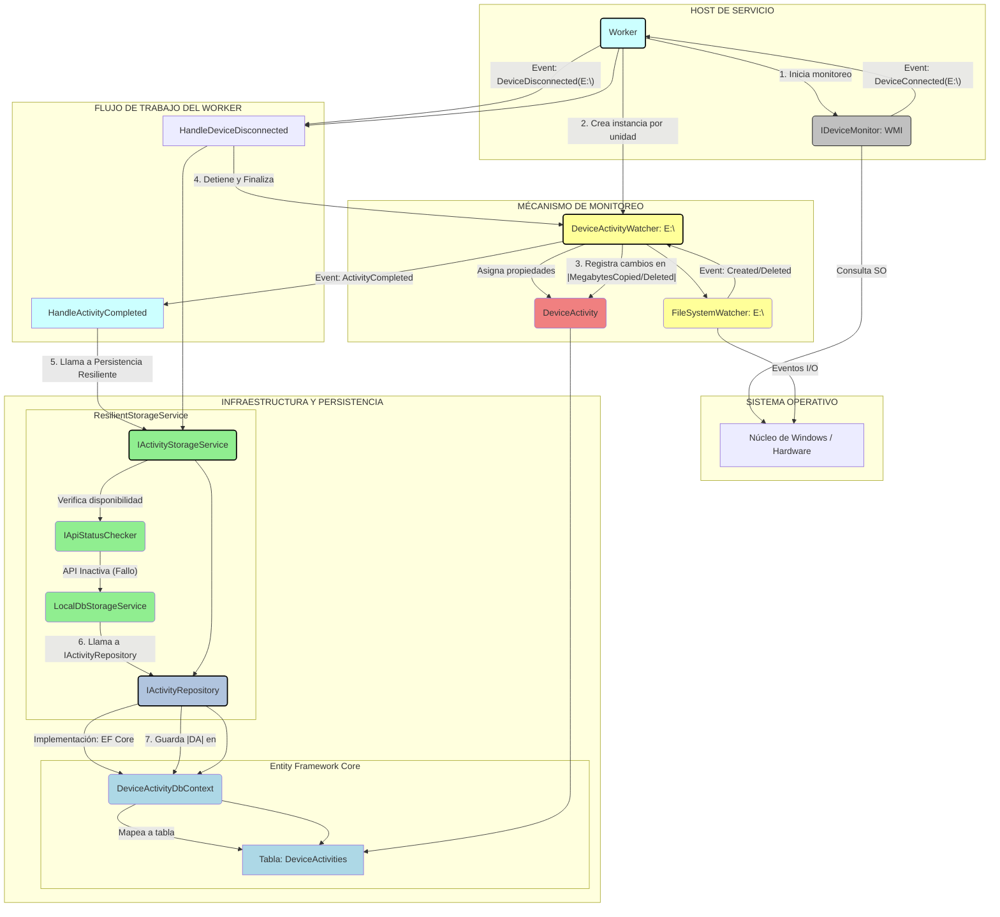

# 🛡️ Device Activity Monitor (DAM)

## Monitoreo Resiliente de Dispositivos Externos para Entornos Empresariales

---

### 🌟 Introducción

**Device Activity Monitor (DAM)** es una solución de monitoreo de actividad de dispositivos externos (USB, discos, móviles, tabletas) diseñada para estaciones de trabajo con Windows. Construida sobre la plataforma moderna de **.NET (C# 10 / .NET 8+)**, esta arquitectura prioriza la **resiliencia**, la **escalabilidad** y el cumplimiento de los principios **SOLID** y patrones como **CQRS** (parcial).

El objetivo principal es capturar toda la actividad de E/S de ficheros (copia, borrado, capacidad) de un dispositivo externo, incluso ante la indisponibilidad de la Web API central de almacenamiento.

### 🏛️ Arquitectura de la Solución

La solución se divide en tres proyectos principales con una capa de infraestructura y otra de dominio compartido:

| Proyecto | Tipo | Responsabilidad | Tecnologías Clave |
| :--- | :--- | :--- | :--- |
| `DAM.Host.WindowsService` | **Host/Worker** | Recolección de datos, monitoreo de eventos de hardware (WMI) y persistencia resiliente. | `BackgroundService`, WMI, Patrón Watcher. |
| `DAM.Presentation.WebAPI` | **Web API** | Punto de entrada para la persistencia remota de datos (API) y exposición de datos de monitoreo. | ASP.NET Core, EF Core. |
| `DAM.Presentation.BlazorApp` | **Frontend** | Interfaz de usuario para visualizar en tiempo real el estado y el historial de actividad de los dispositivos. | Blazor Web App (Interactive/SSR). |
| `DAM.Infrastructure` | **Infraestructura** | Implementación de EF Core (SQLite), Repositorios y la Lógica de Resiliencia (API vs. BD local). | EF Core, `HttpClient`. |
| `DAM.Core` | **Dominio** | Definiciones de entidades, DTOs e interfaces de contratos (SOLID - DIP). | C#, Interfaces. |

### 🌊 Diagrama de Flujo y Relación de Monitoreo

Este diagrama utiliza el tipo Flowchart (Gráfico de Flujo) y muestra la secuencia de eventos (conexión del dispositivo) y las relaciones entre las capas de la aplicación (`Host`, `Core`, `Infrastructure`).



### ⚙️ Características Técnicas

* **Monitoreo de Bajo Nivel:** Uso de **WMI (Windows Management Instrumentation)** para detectar eventos de inserción y remoción de dispositivos.
* **Aislamiento:** Cada dispositivo conectado obtiene un objeto **`DeviceActivityWatcher`** autónomo para monitorear sus operaciones de E/S a través de `FileSystemWatcher`.
* **Resiliencia de Persistencia:** El servicio es capaz de conmutar automáticamente entre **API Remota** y **SQLite Local** si la Web API no está disponible (mecanismo Circuit Breaker simple).
* **Auto-Recuperación del Servicio:** Configuración del servicio de Windows a través de **PowerShell** para garantizar el reinicio automático tras cualquier detención o fallo.

### 🔧 Prerequisitos

* **.NET SDK 8.0 o Superior:** Para compilar y ejecutar los proyectos.
* **Windows OS:** Requerido para el funcionamiento de WMI y el servicio de Windows.
* **PowerShell 5.1+:** Necesario para ejecutar el script de despliegue.

### 🚀 Guía de Instalación y Despliegue

### 1. Clonar el Repositorio

```bash
git clone [https://github.com/potlitel/DeviceActivityMonitor.git](https://github.com/tu-usuario/DeviceActivityMonitor.git)
cd DeviceActivityMonitor
```

### 2\. Compilar la Solución

## 

```Bash
dotnet build
```

### 3\. Despliegue del Servicio de Windows

#### 

Utilice el _script_ de PowerShell para publicar, instalar y configurar la política de recuperación.

##### 🛠️ Instrucciones Detalladas de Uso y Ejecución
Para un despliegue exitoso, asegúrate de haber configurado las rutas (PROJECT_PATH y DEPLOY_PATH) dentro del archivo Install-Service.cmd antes de comenzar.

### 3.1\. Opción 1: 🧑‍💻 Ejecución Directa mediante PowerShell (Requiere Sesión Elevada)

### 

Este método es ideal para desarrolladores o administradores que ya están trabajando dentro de una consola con privilegios elevados.

#### **Pasos:**

### 

1.  **Abrir PowerShell como Administrador:** Haz clic derecho en el icono de PowerShell y selecciona **"Ejecutar como administrador"** (o busca PowerShell, haz clic derecho y selecciona la opción).
    
2.  **Navegar al Directorio:** Usa el comando `cd` para ir a la carpeta donde guardaste `Deploy-Service.ps1`. _Ejemplo:_

    ```powershell
    cd C:\Ruta\De\Los\Scripts
    ```

3.  **Ejecutar el Script con Parámetros:** Lanza el script proporcionando explícitamente las rutas del proyecto y de despliegue.

    ```powershell
    .\Deploy-Service.ps1 -ProjectPath "C:\Ruta\Al\Proyecto\DAM.Host.WindowsService" -DeployPath "C:\Program Files\DeviceActivityMonitor"
    ```

4.  **Verificar Resultado:** Observa la consola. El script mostrará el progreso animado y, al finalizar, el mensaje de éxito: `✅ Despliegue Completado y Servicio Iniciado Correctamente.`.

### 3.2\. Opción 2: 🖱️ Ejecución Mediante el Wrapper de Usuario (Recomendado para Usuarios Finales)

### 

Este método solo requiere un doble clic y maneja la solicitud de permisos de Administrador automáticamente (a través del UAC).

#### **Pasos:**

### 

1.  **Verificar Archivos:** Asegúrate de que los archivos `Deploy-Service.ps1` y `Install-Service.cmd` estén en **la misma carpeta**.
    
2.  **Configurar Rutas (Solo la primera vez):**
    
    -   Abre el archivo **`Install-Service.cmd`** con un editor de texto (como Notepad++ o VS Code).
        
    -   Ajusta las variables `PROJECT_PATH` y `DEPLOY_PATH` para que apunten a las ubicaciones correctas.
        
3.  **Ejecución:** Haz doble clic sobre el archivo **`Install-Service.cmd`**.
    
4.  **Aceptar UAC:** Aparecerá la ventana de **Control de Cuentas de Usuario (UAC)** de Windows. Debes hacer clic en **"Sí"** para permitir que el script se ejecute con permisos de Administrador.
    
5.  **Monitorear Progreso:** Una nueva ventana de PowerShell se abrirá y ejecutará el despliegue, mostrando las barras de progreso animadas para cada paso.
    
6.  **Cerrar Consola:** Una vez finalizada la instalación, el archivo `.cmd` te pedirá que presiones una tecla para cerrar la ventana.

### 🔧 Ejemplo de Configuración de Rutas en `Install-Service.cmd`

### 

Para este ejemplo, asumiremos los siguientes escenarios comunes:

1.  **Ruta del Proyecto (`PROJECT_PATH`):** El código fuente compilado reside dentro de una carpeta de la solución de Visual Studio, listo para ser publicado.
    
2.  **Ruta de Despliegue (`DEPLOY_PATH`):** La carpeta de destino final se encuentra en el directorio estándar de `Archivos de programa`.
    

### Contenido del Archivo `Install-Service.cmd`

```bash
@echo off
REM --- CONFIGURACIÓN DE RUTAS ---
:: Define el nombre del script de PowerShell
set "SCRIPT_NAME=Deploy-Service.ps1"

:: RUTA A DONDE ESTÁ EL PROYECTO .NET CORE
:: 📌 EJEMPLO: Si la solución está en 'C:\SourceCode\MiSolucion'
set "PROJECT_PATH=C:\SourceCode\MiSolucion\DAM.Host.WindowsService"

:: RUTA DONDE SE INSTALARÁ EL SERVICIO (Usualmente Program Files)
:: 📌 EJEMPLO: La carpeta donde residirá el ejecutable final
set "DEPLOY_PATH=C:\Program Files\DeviceActivityMonitor"

REM ------------------------------

echo.
echo =======================================================
echo     Despliegue de Device Activity Monitor
echo =======================================================
echo.
echo El proceso de instalación iniciará en una nueva ventana.
echo NOTA: Debe aceptar el dialogo de Administrador (UAC) para continuar.
echo.
pause

:: Comando para ejecutar el script de PowerShell con privilegios de Administrador (RunAs)
powershell -Command "Start-Process -FilePath 'powershell.exe' -ArgumentList '-NoProfile -ExecutionPolicy Bypass -File \"%~dp0%SCRIPT_NAME%\" -ProjectPath \"%PROJECT_PATH%\" -DeployPath \"%DEPLOY_PATH%\"' -Verb RunAs"

if %ERRORLEVEL% NEQ 0 (
    echo.
    echo ❌ ERROR: La instalación fue cancelada o no se pudo elevar.
    pause > nul
) else (
    echo.
    echo ✅ Despliegue solicitado. Verifique la nueva ventana de PowerShell para el resultado.
    pause > nul
)
```

### 📝 Notas Clave sobre las Rutas

## 

| **Variable** | **Descripción** | **Importancia** |
| --- | --- | --- |
| **`PROJECT_PATH`** | Debe apuntar al **directorio que contiene el archivo `.csproj`** (p. ej., `DAM.Host.WindowsService.csproj`). El comando `dotnet publish` usará esta ruta como punto de partida para compilar. | **Crítico** para que `dotnet publish` funcione. |
| **`DEPLOY_PATH`** | Es la carpeta final donde deseas que el ejecutable (`DAM.Host.WindowsService.exe`) y sus dependencias (si no es `PublishSingleFile`) sean copiados. **El servicio de Windows se instalará desde esta ruta.** | **Crítico** para la instalación y ejecución del servicio. |

### 

El _script_ se encargará de:

-   **🚫 Detener y eliminar** cualquier instancia anterior.
    
-   **📦 Publicar** la aplicación como _self-contained_ (autónoma).
    
-   **💾 Instalar** el servicio de Windows (`sc.exe`).
    
-   **🛡️ Configurar** la política de recuperación (reinicios automáticos).
    
-   **▶️ Iniciar** el servicio..
    

### 4\. Ejecutar la Web API (Inicialmente)

#### 

Para probar el mecanismo resiliente, es recomendable iniciar la API:

```bash
cd DAM.Presentation.WebAPI
dotnet run
```

### 📋 Métricas Recolectadas

#### 

El `DeviceActivityWatcher` registra meticulosamente la siguiente información por sesión de conexión:

-   Información básica: Modelo, Número de Serie, Capacidad.
    
-   Tiempos: `InsertedAt`, `ExtractedAt`, `TimeInserted`.
    
-   Métricas de E/S: **Megabytes copiados** y **borrados**.
    
-   Capacidad: Capacidad disponible al **insertarse** y al **extraerse**.
    
-   Detalle: Listado de **ficheros copiados** y **borrados**.
    
-   Eventos especiales (ej: formateo, a ser implementado).
  
### 🤝 Contribuciones

¡Las contribuciones son bienvenidas! Si deseas ayudar a mejorar este proyecto, puedes hacerlo siguiendo estos pasos:

1. Haz un fork del repositorio.
2. Crea una nueva rama con tu feature o corrección: `git checkout -b nombre-de-tu-rama`
3. Realiza tus cambios y realiza commits claros y descriptivos.
4. Envía un pull request describiendo detalladamente tus modificaciones.

Por favor, asegúrate de que tu código sigue las buenas prácticas, y si haces mejoras significativas, considera incluir pruebas o documentación adicional.

### 📝 Licencia

Este proyecto está bajo la licencia MIT. Consulta el archivo `LICENSE` para más detalles.

### 🙏 Agradecimiento y contacto

¡Gracias por visitar y usar este proyecto! ✨  
Si tienes dudas, sugerencias o quieres contribuir, no dudes en abrir un issue 📥 o contactarme directamente:  

- GitHub: [potlitel](https://github.com/potlitel) 👨‍💻  
- Email: potlitel@gmail.com ✉️  

¡Espero tus aportes y comentarios! 💬😊

