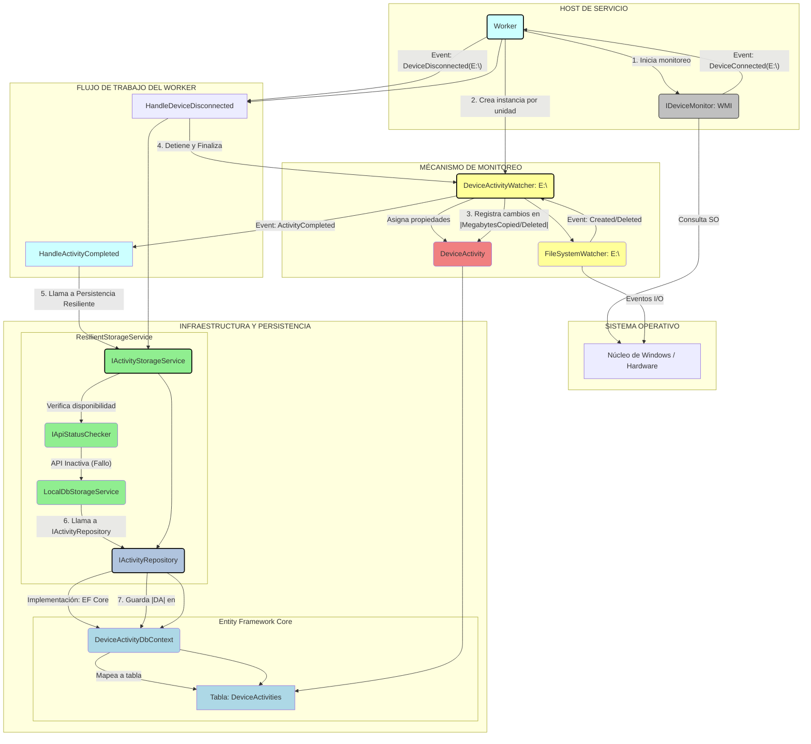

# 🛡️ Device Activity Monitor (DAM)

## Monitoreo Resiliente de Dispositivos Externos para Entornos Empresariales

<!-- [](https://github.com/potlitel/DeviceActivityMonitor/actions/workflows/dotnet-build.yml)
[](https://github.com/potlitel/DeviceActivityMonitor/actions/workflows/dotnet-test.yml) -->
[](https://github.com/potlitel/DeviceActivityMonitor/releases)
[](LICENSE)

[](https://dotnet.microsoft.com/)
[](https://docs.microsoft.com/en-us/dotnet/csharp/)
[]()
[]()
[]()
[]()
[](https://github.com/potlitel/DeviceActivityMonitor/pulls)

---

### 🌟 Introducción

**Device Activity Monitor (DAM)** es una solución de monitoreo de actividad de dispositivos externos (USB, discos, móviles, tabletas) diseñada para estaciones de trabajo con Windows. Construida sobre la plataforma moderna de **.NET (C# 10 / .NET 8+)**, esta arquitectura prioriza la **resiliencia**, la **escalabilidad** y el cumplimiento de los principios **SOLID** y patrones como **CQRS** (parcial).

El objetivo principal es capturar toda la actividad de E/S de ficheros (copia, borrado, capacidad) de un dispositivo externo, incluso ante la indisponibilidad de la Web API central de almacenamiento.

---

## 🧭 Tabla de Contenido

- [🛡️ Device Activity Monitor (DAM)](#️-device-activity-monitor-dam)
  - [Monitoreo Resiliente de Dispositivos Externos para Entornos Empresariales](#monitoreo-resiliente-de-dispositivos-externos-para-entornos-empresariales)
    - [🌟 Introducción](#-introducción)
  - [🧭 Tabla de Contenido](#-tabla-de-contenido)
    - [🏛️ Arquitectura de la Solución (DAM)](#️-arquitectura-de-la-solución-dam)
      - [La solución se estructura en capas bien definidas, siguiendo principios de diseño limpio. Esto facilita la **separación de responsabilidades**, el **mantenimiento**, y por supuesto, el **testing** del sistema.](#la-solución-se-estructura-en-capas-bien-definidas-siguiendo-principios-de-diseño-limpio-esto-facilita-la-separación-de-responsabilidades-el-mantenimiento-y-por-supuesto-el-testing-del-sistema)
    - [🌊 Diagrama de Flujo y Relación de Monitoreo](#-diagrama-de-flujo-y-relación-de-monitoreo)
    - [⚙️ Características Técnicas](#️-características-técnicas)
    - [🔧 Prerequisitos](#-prerequisitos)
    - [🚀 Guía de Instalación y Despliegue](#-guía-de-instalación-y-despliegue)
    - [1. Clonar el Repositorio](#1-clonar-el-repositorio)
    - [2. Compilar la Solución](#2-compilar-la-solución)
    - [3. Despliegue del Servicio de Windows](#3-despliegue-del-servicio-de-windows)
    - [📦 Flujo de Despliegue y Distribución](#-flujo-de-despliegue-y-distribución)
    - [3.1. ⚙️ Fase 1: Generación del Paquete de Distribución (Para Desarrolladores)](#31-️-fase-1-generación-del-paquete-de-distribución-para-desarrolladores)
      - [**Instrucciones para Generar el ZIP:**](#instrucciones-para-generar-el-zip)
    - [3.2. 🛠️ Fase 2: Instalación del Servicio (Para Usuarios Finales/Administradores)](#32-️-fase-2-instalación-del-servicio-para-usuarios-finalesadministradores)
      - [**Instrucciones Detalladas:**](#instrucciones-detalladas)
    - [Contenido del Archivo `Install-Service.cmd`](#contenido-del-archivo-install-servicecmd)
    - [4. Ejecutar la Web API (Inicialmente)](#4-ejecutar-la-web-api-inicialmente)
    - [📋 Métricas Recolectadas](#-métricas-recolectadas)
  - [📚 Recursos y Documentación Especializada](#-recursos-y-documentación-especializada)
    - [🧪 Validación del Código (Testing)](#-validación-del-código-testing)
    - [🤝 Contribuciones](#-contribuciones)
    - [📝 Licencia](#-licencia)
    - [🙏 Agradecimiento y contacto](#-agradecimiento-y-contacto)

---

### 🏛️ Arquitectura de la Solución (DAM)

#### La solución se estructura en capas bien definidas, siguiendo principios de diseño limpio. Esto facilita la **separación de responsabilidades**, el **mantenimiento**, y por supuesto, el **testing** del sistema.

| **Proyecto** | **Tipo** | **🎯 Responsabilidad Principal** | **Tecnologías Clave** |
| --- | --- | --- | --- |
| `DAM.Host.WindowsService` | **Host/Worker** | Recolección de datos, monitoreo de eventos de hardware (WMI) y persistencia resiliente. | `BackgroundService`, WMI, Patrón Watcher. |
| `DAM.Presentation.WebAPI` | **Web API** | Punto de entrada para la persistencia remota de datos (API) y exposición de datos de monitoreo. | ASP.NET Core, EF Core. |
| `DAM.Presentation.BlazorApp` | **Frontend** | Interfaz de usuario para visualizar en tiempo real el estado y el historial de actividad de los dispositivos. | Blazor Web App (Interactive/SSR). |
| `DAM.Infrastructure` | **Infraestructura** | Implementación de EF Core (SQLite), Repositorios y la Lógica de Resiliencia (API vs. BD local). | EF Core, `HttpClient`. |
| `DAM.Core` | **Dominio** | Definiciones de entidades, DTOs e interfaces de contratos (SOLID - DIP). | C#, Interfaces. |
| **`DAM.Tests.Monitoring`** | **Pruebas Automatizadas** | **Verificación** de la lógica de negocio, integración con datos y simulación del flujo completo del servicio `Worker`. | **XUnit**, Moq, EF Core In-Memory. |

### 🌊 Diagrama de Flujo y Relación de Monitoreo

Este diagrama utiliza el tipo Flowchart (Gráfico de Flujo) y muestra la secuencia de eventos (conexión del dispositivo) y las relaciones entre las capas de la aplicación (`Host`, `Core`, `Infrastructure`).



### ⚙️ Características Técnicas

* **Monitoreo de Bajo Nivel:** Uso de **WMI (Windows Management Instrumentation)** para detectar eventos de inserción y remoción de dispositivos.
* **Aislamiento:** Cada dispositivo conectado obtiene un objeto **`DeviceActivityWatcher`** autónomo para monitorear sus operaciones de E/S a través de `FileSystemWatcher`.
* **Resiliencia de Persistencia:** El servicio es capaz de conmutar automáticamente entre **API Remota** y **SQLite Local** si la Web API no está disponible (mecanismo Circuit Breaker simple).
* **Auto-Recuperación del Servicio:** Configuración del servicio de Windows a través de **PowerShell** para garantizar el reinicio automático tras cualquier detención o fallo.

### 🔧 Prerequisitos

* **.NET SDK 8.0 o Superior:** Para compilar y ejecutar los proyectos.
* **Windows OS:** Requerido para el funcionamiento de WMI y el servicio de Windows.
* **PowerShell 5.1+:** Necesario para ejecutar el script de despliegue.

### 🚀 Guía de Instalación y Despliegue

### 1. Clonar el Repositorio

```bash
git clone https://github.com/potlitel/DeviceActivityMonitor.git
cd DeviceActivityMonitor
```

### 2\. Compilar la Solución

```Bash
dotnet build
```

### 3\. Despliegue del Servicio de Windows

El despliegue ha sido refactorizado para utilizar un **Paquete de Distribución (ZIP de Publicación)**, lo que simplifica la instalación para el usuario final a un único paso.

### 📦 Flujo de Despliegue y Distribución

El proceso se divide en dos fases:
1.  **Generación del Paquete (Lado del Desarrollador):** Utilizando el script de empaquetado.
2.  **Instalación (Lado del Usuario Final/Administrador):** Utilizando el paquete generado.

---

### 3.1. ⚙️ Fase 1: Generación del Paquete de Distribución (Para Desarrolladores)

El script `Create-Release.ps1` automatiza la publicación del proyecto .NET, copia el script de despliegue necesario y empaqueta todo en un único archivo ZIP listo para ser distribuido.

#### **Instrucciones para Generar el ZIP:**

1.  **Ubicación:** Asegúrate de que `Create-Release.ps1` se encuentre en el **directorio raíz de la solución**.
2.  **Ejecución:** Abre PowerShell en esa ubicación y ejecuta el script:

    ```powershell
    .\Create-Release.ps1
    ```

3.  **Resultado:** El script creará una carpeta llamada `Releases` en la raíz de la solución, y dentro, el archivo ZIP con la nomenclatura:
    `[NombreProyecto]-Release-[FechaHora].zip`

    Debes obtener una salida similar a la siguiente:

    ```powershell
    .\Create-Release.ps1
    1. Publicando proyecto 'DAM.Host.WindowsService'...
    Restore complete (1.7s)                                                                                                                                                 
        DAM.Core net10.0 succeeded (0.3s) → DAM.Core\bin\Release\net10.0\DAM.Core.dll
        DAM.Infrastructure net10.0 succeeded (0.4s) → DAM.Infrastructure\bin\Release\net10.0\DAM.Infrastructure.dll 
        DAM.Host.WindowsService net10.0 win-x64 succeeded (1.6s) → bin\Release\PublishTemp\  
    Build succeeded in 5.3s                   
    2. Copiando script de despliegue ajustado...
    3. Generando archivo de notas de release...
    4. Creando paquete de despliegue ZIP...
    5. Aplicando política de retención (manteniendo los últimos 5 releases)...
       -> Número de releases menor o igual al límite. No se requiere limpieza.

    ✅ ¡Paquete de Despliegue Listo!
    Ruta del paquete: C:\Users\potli\OneDrive\Documentos\Alexis-Cuba\DeviceActivityMonitor\Releases\DAM.Host.WindowsService-Release-20251213-103545.zip
    Instrucción para el usuario: Descomprima el ZIP y ejecute 'Install-Service.ps1' como Administrador.
    ```

---

### 3.2. 🛠️ Fase 2: Instalación del Servicio (Para Usuarios Finales/Administradores)

Una vez que se tiene el paquete ZIP, la instalación es sencilla y directa.

#### **Instrucciones Detalladas:**

1.  **Descomprimir el Paquete:** Descomprime el archivo ZIP de publicación en la ubicación de tu preferencia (ej. `C:\Instalacion\`).
2.  **Ejecutar el Instalador:** Dentro de la carpeta descomprimida, localiza el script renombrado `Install-Service.ps1`.
3.  **Ejecutar como Administrador:** Haz clic derecho en `Install-Service.ps1` y selecciona **"Ejecutar con PowerShell"**.

    > ⚠️ **Nota:** Aparecerá la ventana del **Control de Cuentas de Usuario (UAC)**. Debes hacer clic en **"Sí"** para permitir que el script se ejecute con permisos elevados.

4.  **Monitorear y Finalizar:** El script se ejecutará, publicará el servicio de Windows y lo iniciará automáticamente, mostrando el mensaje de éxito:
    `✅ ¡Despliegue Completado y Servicio Iniciado Correctamente!`
    

### Contenido del Archivo `Install-Service.cmd`

```bash
@echo off
REM --- CONFIGURACIÓN DE RUTAS ---
:: Define el nombre del script de PowerShell
set "SCRIPT_NAME=Deploy-Service.ps1"

:: RUTA A DONDE ESTÁ EL PROYECTO .NET CORE
:: 📌 EJEMPLO: Si la solución está en 'C:\SourceCode\MiSolucion'
set "PROJECT_PATH=C:\SourceCode\MiSolucion\DAM.Host.WindowsService"

:: RUTA DONDE SE INSTALARÁ EL SERVICIO (Usualmente Program Files)
:: 📌 EJEMPLO: La carpeta donde residirá el ejecutable final
set "DEPLOY_PATH=C:\Program Files\DeviceActivityMonitor"

REM ------------------------------

echo.
echo =======================================================
echo     Despliegue de Device Activity Monitor
echo =======================================================
echo.
echo El proceso de instalación iniciará en una nueva ventana.
echo NOTA: Debe aceptar el dialogo de Administrador (UAC) para continuar.
echo.
pause

:: Comando para ejecutar el script de PowerShell con privilegios de Administrador (RunAs)
powershell -Command "Start-Process -FilePath 'powershell.exe' -ArgumentList '-NoProfile -ExecutionPolicy Bypass -File \"%~dp0%SCRIPT_NAME%\" -ProjectPath \"%PROJECT_PATH%\" -DeployPath \"%DEPLOY_PATH%\"' -Verb RunAs"

if %ERRORLEVEL% NEQ 0 (
    echo.
    echo ❌ ERROR: La instalación fue cancelada o no se pudo elevar.
    pause > nul
) else (
    echo.
    echo ✅ Despliegue solicitado. Verifique la nueva ventana de PowerShell para el resultado.
    pause > nul
)
```    

### 4\. Ejecutar la Web API (Inicialmente)

Para probar el mecanismo resiliente, es recomendable iniciar la API:

```bash
cd DAM.Presentation.WebAPI
dotnet run
```

### 📋 Métricas Recolectadas

El `DeviceActivityWatcher` registra meticulosamente la siguiente información por sesión de conexión:

-   Información básica: Modelo, Número de Serie, Capacidad.
    
-   Tiempos: `InsertedAt`, `ExtractedAt`, `TimeInserted`.
    
-   Métricas de E/S: **Megabytes copiados** y **borrados**.
    
-   Capacidad: Capacidad disponible al **insertarse** y al **extraerse**.
    
-   Detalle: Listado de **ficheros copiados** y **borrados**.
    
-   Eventos especiales (ej: formateo, a ser implementado).
  

<!-- ## Documentación Técnica

* [**Estrategia de Pruebas**](./DAM.Tests.Monitoring/README_TESTS.md) -->

## 📚 Recursos y Documentación Especializada

Esta sección contiene enlaces directos a la documentación detallada y a los manuales técnicos esenciales para comprender a fondo el proyecto.

* * *

### 🧪 Validación del Código (Testing)

Profundiza en cómo garantizamos la calidad y la fiabilidad de nuestro código.

| **Documento** | **🎯 Enfoque Principal** | **Enlace Rápido** |
| --- | --- | --- |
| **Estrategia de Pruebas** | Cobertura de la lógica de negocio, integración con EF Core, y flujo End-to-End (E2E) del `Worker Service`. | **[Ir a la Documentación Completa](./DAM.Tests.Monitoring/README_TESTS.md)** |

### 🤝 Contribuciones

¡Las contribuciones son bienvenidas! Si deseas ayudar a mejorar este proyecto, puedes hacerlo siguiendo estos pasos:

1. Haz un fork del repositorio.
2. Crea una nueva rama con tu feature o corrección: `git checkout -b nombre-de-tu-rama`
3. Realiza tus cambios y realiza commits claros y descriptivos.
4. Envía un pull request describiendo detalladamente tus modificaciones.

Por favor, asegúrate de que tu código sigue las buenas prácticas, y si haces mejoras significativas, considera incluir pruebas o documentación adicional.

### 📝 Licencia

Este proyecto está bajo la licencia MIT. Consulta el archivo `LICENSE` para más detalles.

### 🙏 Agradecimiento y contacto

¡Gracias por visitar y usar este proyecto! ✨  
Si tienes dudas, sugerencias o quieres contribuir, no dudes en abrir un issue 📥 o contactarme directamente:  

- GitHub: [potlitel](https://github.com/potlitel) 👨‍💻  
- Email: potlitel@gmail.com ✉️  

¡Espero tus aportes y comentarios! 💬😊

