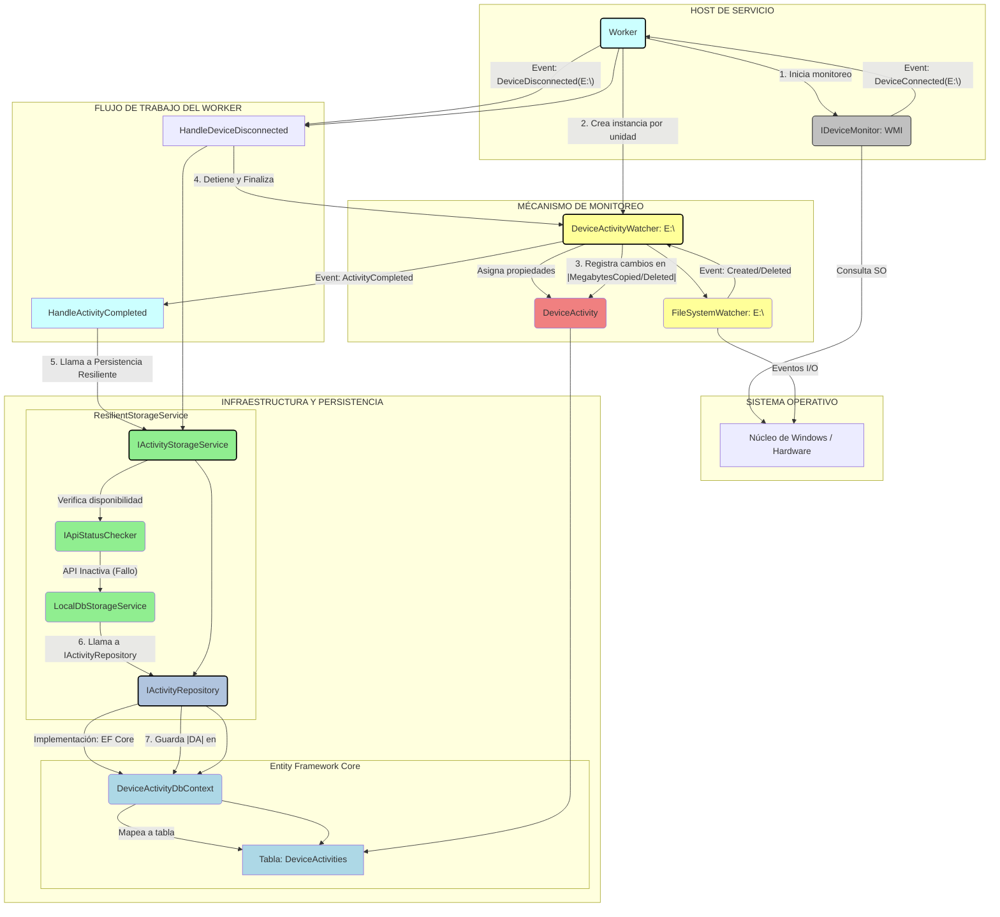

# 🛡️ Device Activity Monitor (DAM)

## Monitoreo Resiliente de Dispositivos Externos para Entornos Empresariales

---

### 🌟 Introducción

**Device Activity Monitor (DAM)** es una solución de monitoreo de actividad de dispositivos externos (USB, discos, móviles, tabletas) diseñada para estaciones de trabajo con Windows. Construida sobre la plataforma moderna de **.NET (C# 10 / .NET 8+)**, esta arquitectura prioriza la **resiliencia**, la **escalabilidad** y el cumplimiento de los principios **SOLID** y patrones como **CQRS** (parcial).

El objetivo principal es capturar toda la actividad de E/S de ficheros (copia, borrado, capacidad) de un dispositivo externo, incluso ante la indisponibilidad de la Web API central de almacenamiento.

### 🏛️ Arquitectura de la Solución

La solución se divide en tres proyectos principales con una capa de infraestructura y otra de dominio compartido:

| Proyecto | Tipo | Responsabilidad | Tecnologías Clave |
| :--- | :--- | :--- | :--- |
| `DAM.Host.WindowsService` | **Host/Worker** | Recolección de datos, monitoreo de eventos de hardware (WMI) y persistencia resiliente. | `BackgroundService`, WMI, Patrón Watcher. |
| `DAM.Presentation.WebAPI` | **Web API** | Punto de entrada para la persistencia remota de datos (API) y exposición de datos de monitoreo. | ASP.NET Core, EF Core. |
| `DAM.Presentation.BlazorApp` | **Frontend** | Interfaz de usuario para visualizar en tiempo real el estado y el historial de actividad de los dispositivos. | Blazor Web App (Interactive/SSR). |
| `DAM.Infrastructure` | **Infraestructura** | Implementación de EF Core (SQLite), Repositorios y la Lógica de Resiliencia (API vs. BD local). | EF Core, `HttpClient`. |
| `DAM.Core` | **Dominio** | Definiciones de entidades, DTOs e interfaces de contratos (SOLID - DIP). | C#, Interfaces. |

### 🌊 Diagrama de Flujo y Relación de Monitoreo

Este diagrama utiliza el tipo Flowchart (Gráfico de Flujo) y muestra la secuencia de eventos (conexión del dispositivo) y las relaciones entre las capas de la aplicación (`Host`, `Core`, `Infrastructure`).



### ⚙️ Características Técnicas

* **Monitoreo de Bajo Nivel:** Uso de **WMI (Windows Management Instrumentation)** para detectar eventos de inserción y remoción de dispositivos.
* **Aislamiento:** Cada dispositivo conectado obtiene un objeto **`DeviceActivityWatcher`** autónomo para monitorear sus operaciones de E/S a través de `FileSystemWatcher`.
* **Resiliencia de Persistencia:** El servicio es capaz de conmutar automáticamente entre **API Remota** y **SQLite Local** si la Web API no está disponible (mecanismo Circuit Breaker simple).
* **Auto-Recuperación del Servicio:** Configuración del servicio de Windows a través de **PowerShell** para garantizar el reinicio automático tras cualquier detención o fallo.

### 🔧 Prerequisitos

* **.NET SDK 8.0 o Superior:** Para compilar y ejecutar los proyectos.
* **Windows OS:** Requerido para el funcionamiento de WMI y el servicio de Windows.
* **PowerShell 5.1+:** Necesario para ejecutar el script de despliegue.

### 🚀 Guía de Instalación y Despliegue

#### 1. Clonar el Repositorio

```bash
git clone [https://github.com/potlitel/DeviceActivityMonitor.git](https://github.com/tu-usuario/DeviceActivityMonitor.git)
cd DeviceActivityMonitor